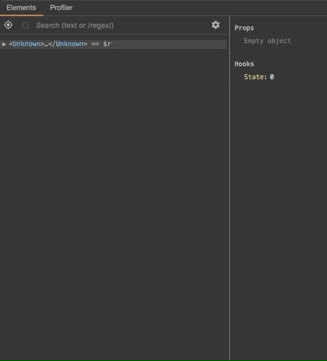
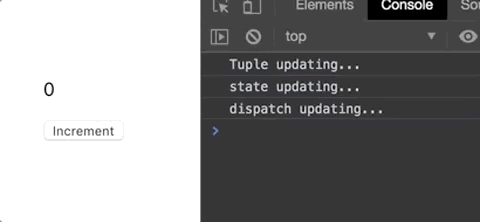

## Context's Caveat

If you are a performance nut like me, you'd probably be at some point hesitant about using React's Context API. At the bottom of its [documentation](https://reactjs.org/docs/context.html#caveats), there is a little _Caveat_ section that says:

> Because context uses reference identity to determine when to re-render, there are some gotchas that could trigger unintentional renders in consumers when a provider’s parent re-renders. For example, the code below will re-render all consumers every time the Provider re-renders because a new object is always created for value:

```js
class App extends React.Component {
  render() {
    return (
      <Provider value={{something: 'something'}}>
        <Toolbar/>
      </Provider>
    );
  }
}
```

Well, ok, great, but how bad can this really be? I will not go so far as to criticize React's docs ('cause it's freaking awesome), but I felt they could have explained this better. For a long time I tried not to make this particular mistake, safely memoizing context value before passing it to the provider ([and here's a great guide for it](https://kentcdodds.com/blog/how-to-optimize-your-context-value)) without knowing what exactly am I running away from, and often times it gives me feelings of irrational paranoia. It's never good to not know what you're doing, or why you are doing so.

So, let's find out what's really happening. _What exactly is this caveat we are talking about?_

Let's start with an example:

```js
const Context = createContext(null);

export default () => {
  const [count, setCount] = useState(0);
  return (
    <Context.Provider value={{beep: 'boop'}}> // highlight-line
      <div>
        <Foo/>
        <p>{count}</p>
        <button onClick={() => setCount(count + 1)}>Incr</button>
      </div>
    </Context.Provider>
  );
};

const Foo = () => {
  const ctx = useContext(Context);
  return (
    <p>{ctx.beep}</p>
  );
};
```

So this is the behavior that we are trying to avoid. So how do we test if this is bad?

In the React Dev Tool, there's a neat thing called _Highlight Updates_ that we can use to watch for re-renders.



Now, whenever React does a re-render, the affected elements will highlight themselves blue.


This is the behavior that they want you to avoid. Every time the counter state in the parent component increments, a re-render triggers in the parent, resulting in `<Foo/>` re-rendering as well.

So apparently the fix is to memoize the context value. Let us then modify the code a little bit.

```js
export default () => {
  const [count, setCount] = useState(0);
  const value = useMemo(() => { // highlight-line
    return { // highlight-line
      beep: 'boop' // highlight-line
    }; // highlight-line
  }, []); // highlight-line
  return (
    <Context.Provider value={value}> // highlight-line
      <div>
        <Foo/>
        <p>{count}</p>
        <button onClick={() => setCount(count + 1)}>Incr</button>
      </div>
    </Context.Provider>
  );
};
```

However, the result is still the same:


<p class="textDescription">But why? 😱</p>

Well, this is the part where React's Context API kept me up all night long. This whole thing can come across as really weird without a proper explanation.

One characteristic of Context is that you can only call a Consumer inside a Provider. But then, the default behavior of React is that whenever a parent component re-renders, every child of that component will re-render along with it. If that is the case then why exactly do we have to memoize the context value when we can't use Consumers outside of Provider, so all child components will end up re-rendering anyway?

Well here's the punch line: **You need to memoize your component!**

Let's recap a little bit. To memoize a component is when you:
* Use `shouldComponentUpdate` in Class component
* Use `PureComponent` in a Class component
* Use `React.memo` in a functional component

Memoizing a component allows it to not re-render alongside its parent component, except when it's own value changes. Most of the time you will be using `PureComponent` and `memo`, both of which calculates re-render via shallow comparison.

So what does this mean in the context of Context? **It means that if you don't memoize the Consumer, it doesn't matter whether you memoize the context value or not.** And since you should **always memoize your components** anyway, the caveat is making much more sense now.

Now, wrap your `Foo` component with `memo`:
```js
export default () => {
  const [count, setCount] = useState(0);
  const value = useMemo(() => { // highlight-line
    return { // highlight-line
      beep: 'boop' // highlight-line
    }; // highlight-line
  }, []); // highlight-line
  return (
    <Context.Provider value={value}> // highlight-line
      <div>
        <Foo/>
        <p>{count}</p>
        <button onClick={() => setCount(count + 1)}>Incr</button>
      </div>
    </Context.Provider>
  );
};

const Foo = memo(() => { // highlight-line
  const ctx = useContext(Context);
  return (
    <p>{ctx.beep}</p>
  );
});
```

Now let's test the thing:


<p class="textDescription">Profit 🎉🎉🎉🎉🎉</p>

See how the blue highlight on Foo disappears? That means Foo won't re-render anymore unless the context changes.

To recap what just happened: **you have to memoize the Consumers so that when you memoize the context value, any re-render not causing by the context will not notify the memoized Consumers**.

What's equally important to understand is that **if you do memoize your Consumer but does not memoize your context value, the memoization effect on your Consumer will get cancelled out**. Also, **if your Consumer is not memoized, it doesn't matter either way.**

So, if we are talking about the _how bad does it get_ perspective, it doesn't sound as catastrophic as when you don't really know what's going on. It would be similar to the times where we don't have `memo` or `PureComponent` to work with. It's good to understand that the lack of Context etiquette will not break your app down, it's not _that_ scary. However, if you wish to bring your React app to the next level, every little optimization counts. The effect of this optimization / caveat will accumulate along with your project's size. If you can obtain these great little habits and pay attention to details, you will be able to save a huge amount of refactor effort and offer your users a consistently excellent UX experience.

## Understanding the Caveat


So, let's go back to this simple Context example:

```js
const Context = createContext(null);

export default () => {
  const [count, setCount] = useState(0);
  return (
    <Context.Provider value={{count, setCount}}>
      {/* etc */}
    </Context.Provider>
  );
};
```

So what's really wrong with this? First of all, here are a few important concepts to understand:

- States and setters are naturally memoized in React. This means that during a render, React **does not create a new copy of the setter, and the state will only change via a setter**.
- When you write an inline object inside `render` or on the body of a functional component without memoization, React will create a new reference of that object on every render.
- When a new container object is re-rendered, and that object contains memoized contents, **only the container object changes, the memoized content stays the same**. That's the behavior of a shallow copy.

Applying these knowledge to the code snippet above, you can see that the Context provider is constantly **creating a container object on every re-render**. Yes, **just the container**, but it's bad enough to do considerable performance damage. On the other hand, it won't be as bad as breaking your states and reducers and setting your house on fire. Take that into consideration and decide for yourself what is acceptable.

**Now this is where things get interesting** 😎

Let's say you want to make a Context provider with an `useReducer`. Normally it would be something like this:

```js
export default () => {
  const [{foo}, dispatch] = useReducer(reducer, initialState);
  
  const contextValue = useMemo(() => ({
    foo,
    setFoo: (payload) => dispatch({type: 'SET_FOO', payload})
  }), [foo]);
  
  return (
    <Context.Provider value={contextValue}>
      {/* etc */}
    </Context.Provider>
  );
};
```

But when you are planning to make a giant reducer with a complicated state and lots of dispatches, maybe you'd think about passing the reducer tuple itself and let the Consumers do the dispatches. It goes something like:

```js
// BAD EXAMPLE, DO NOT FOLLOW
export default () => {
  const reducerTuple = useReducer(reducer, initialState);
  
  return (
    <Context.Provider value={reducerTuple}>
      {/* etc */}
    </Context.Provider>
  );
};
```

And then use it like a global reducer:

```js
export default () => {
  const [{foo}, dispatch] = useContext(Context);
  
  return (
    <div>
      <p>{foo}</p>
      <button onClick={() => dispatch(foo + 1)}>Set Foo</button>
    </div>
  );
};
```

Now this might seem like a good idea, **well, it's not**. I don't know if this has been mentioned anywhere, but for `useReducer`, **the tuple that holds the state and the dispatch will change on every render**. Why this doesn't matter in a normal functional component, putting the tuple as a context value will trigger the caveat that we discussed above. This also applies to `useState`, although it's less likely that anyone would use the state tuple as the value.

```js
export default () => {
  const reducerTuple = useState(reducer, initialState);

  useEffect(() => console.log('Tuple updating...'), [reducerTuple]);

  const [state, setState] = reducerTuple;

  useEffect(() => console.log('state updating...'), [state]);
  useEffect(() => console.log('dispatch updating...'), [setState]);

  const [count, setCount] = useState(0);

  return (
    <div>
      <p>{count}</p>
      <button onClick={() => setCount(count + 1)}>Increment</button>
    </div>  
  );
};
```



See how the tuple gets created every re-render, but not the state nor the tuple?

To get over this problem, either you can break down the state and dispatch like everyone else, or you can memoize the container itself.

```js
// DO THIS
export default () => {
  const [state, dispatch] = useReducer(reducer, initialState);
  const reducerTuple = useMemo(() => [state, dispatch], state); // highlight-line
  
  return (
    <Context.Provider value={reducerTuple}>
      {/* etc */}
    </Context.Provider>
  );
};
```

## tl;dr

Lessons to take away:

* Always memoize your components
* Memoizing context values only matters when you memoize the Consumers
* Putting an inline container object as Context value will only create a new container on every render, not the memoized properties, but that's bad enough
* State and reducer tuples will not memoize itself, be careful when using them directly in a context

Cheers! 👍