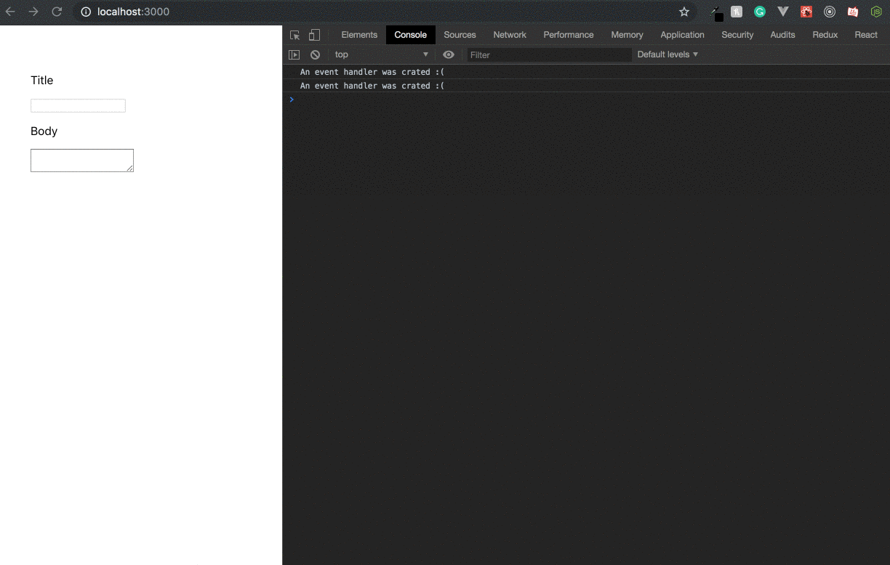

The word _Memoization_ used to scare the 💩 out of me. I pictured it some kind of dark forbidden art of ancient magic, a discipline that only the most experienced coding wizards could hone. Over time, as I gained more skill and on my way into mastering React, _it still scared the 💩 outta me_.

Before going forward, you can read this sentence coming straight from [React docs on the `useMemo` hook](https://reactjs.org/docs/hooks-reference.html#usememo):

> Write your code so that it still works without useMemo — and then add it to optimize performance.

Take it as a thumb rule before going forward. _Memoization doesn't make or break a React app_. That is why, before the introduction of hooks, it was quite difficult to memoize values in React. You either needed to rely on Javascript tricks to achieve the effect, or use 3rd party libraries like [Moize](https://github.com/planttheidea/moize) or [react-memoize](https://github.com/theKashey/react-memoize). Not to mention, memoizing values in React will make your code more verbose and obfuscated, and can even introduce errors if poorly done.

That's why you, before journey into the valley of darkness, should understand the price you will pay to achieve maximum performance optimization. If all is understood, I will henceforth show you, in my experience, how to correctly and effectively memoize values in React.

## So what is memoization anyway?

Let's say you want to make a table, but you don't have a hammer. You go to the local blacksmith and ask him to make you a steel hammer. You come home and use the hammer to make a neat little table.

The next day, you realize that you need to make some chairs. **So, would you go to the blacksmith and ask for another hammer, or do you just use the one he already made for you?**

That is what memoization is all about. If you don't fancy metaphors, you can checkout the [wikipedia definition](https://en.wikipedia.org/wiki/Memoization) here.

Let's start with a simple Javascript example:
```js
function getTodos() {
  return fetch('https://jsonplaceholder.typicode.com/todos/')
    .then(val => val.json());
}

setInterval(() => {
  getTodos().then(val => console.log(val));
}, 1000);
```

This piece of code will attempt to fetch todo notes from the placeholder endpoint then log them into the console every second. Now, the problem is, every time you want to log the code, you'd have to fetch the data again. **This is highly inefficient and can lead to race condition.**

Imagine you're the owner of a server that handles high frequency API calls. Every unnecessary API call you make to the server will congest the server, add a few cents to the traffic cost and make your code much slower.

So how do we fix this? We memoize, of course:

```js
let todos;

function getTodos() {
  if (!todos) {
    return fetch('https://jsonplaceholder.typicode.com/todos/')
      .then(val => {
        todos = val.json();
        return todos;
      });
  }
  return Promise.resolve(todos);
}

setInterval(() => {
  getTodos().then(val => console.log(val));
}, 1000);
```

So what just happened here? First, we attempt to create the reference `blogs` that will hold the memoized todos for us. Then in `getTodos`, we will attempt to fetch the todos once. The next time `getTodos` is called, it will attempt to check if `todos` is undefined, and if it's not, the function will simply resolve the memoized value and not make a hassle of fetching. As mentioned above, this can be useful in many cases.

However, do you notice how this function has become much harder to understand?

> But, but, if you call yourself a good programmer you have to write hard to understand code, amirite?

You know, not really. It's not a big deal if you are the only one who participates in the code (that is excluding the possibility that you can confuse yourself with your own code). However, if there are other maintainers of the code who aren't on your level or not on the same page with you, writing confusing code will damage readability and maintainability of your code. My advice, as always, is to understand the pros and cons of everything before you use them.

If you understand the caveats and decide to optimize, memoization can become a crucial technique for improving performance, reduce traffic cost and provide your consumers a nice, clean interface with great user experience.

## Memoization in Class Components

Before the time of functional components and hooks, we had to make use of Javascript tricks to optimize in React because there is not really an official memoization tool back then.

Consider a class component:

```js
export default class App extends React.Component {
  state = {
    counter: 0
  };
  
  render() {
    const {counter} = this.state;
    return (
      <div>
        <p>{counter}</p>
        <button onClick={() => this.setState(counter => counter + 1)}> // highlight-line
          Increment
        </button> 
      </div>
    );
  }
}
```

Know that when an action in React triggers a re-render, React will try to **run the render() function again**. This means that if you can somehow declare values and functions **in the body of the class**, those values and functions will not end up getting recreated during render and therefore achieved the effect of memoization.

In the example code above, notice how I declare the onClick event listener inside `render()` if you use eslint for React, you will notice how the linter [would complain about this kind of code](https://github.com/yannickcr/eslint-plugin-react/blob/master/docs/rules/jsx-no-bind.md). When you declare the inline arrow function inside render, you are effectively creating the function inside the render, and React would keep recreating this function on every re-render. It not a problem for one-liner functions (I'm guilty for doing one-liner inline functions all the time 😛), but it's an issue for big ones.

To fix this, we can declare the event listener in the body of the class:

```js
export default class App extends React.Component {
  state = {
    counter: 0
  };
  
  handleClick = () => { // highlight-line
    this.setState(counter => counter + 1); // highlight-line
  }; // highlight-line
  
  render() {
    const {counter} = this.state;
    return (
      <div>
        <p>{counter}</p>
        <button onClick={this.handleClick}> // highlight-line
          Increment
        </button> 
      </div>
    );
  }
}
```

This is what I call **in-class memoization** (not an universal term, don't quote me on this 😛).

There is one more way to memoize values in this situation (works for both class components and functional components). **If you have an event handler or any value that are not dependent on any of your state or props, you can declare them outside of the class**.

```js
const handleLog = () => { // highlight-line
  console.log('💩💩💩'); // highlight-line
}; // highlight-line

const dudes = {  // highlight-line
  smilingDude: '😆',  // highlight-line
  sickDude: '🤮'  // highlight-line
};  // highlight-line

export default class App extends React.Component {
  state = {
    someStateThatYouAreNotGoingToUse: 0
  };
  
  render() {
    return (
      <div>
        <p>All happy, all smiling {dudes.smilingDude}</p> // highlight-line
        <button onClick={handleLog}> // highlight-line
          Dude, something smells really bad {dudes.sickDude} // highlight-line
        </button> // highlight-line
      </div>
    );
  }
}
```

Don't get freak out when you declare stuff outside classes. React will not tamper with anything outside class declaration. It won't cause any memory leak or kidnap your girlfriend. Well, that is if you're not silly enough to try and mutate values outside your component 🙅. If for any reason that you're insecure about this syntax, you can always declare these values inside the class, no biggie (but not inside a functional component!). **Please avoid writing React like this**:

```js
// BAD EXAMPLE, DO NOT FOLLOW!
// BAD EXAMPLE, DO NOT FOLLOW!
// BAD EXAMPLE, DO NOT FOLLOW!

render() {
  const handleLog = () => { // highlight-line
    console.log('💩💩💩'); // highlight-line
  }; // highlight-line
  
  const dudes = {  // highlight-line
    smilingDude: '😆',  // highlight-line
    sickDude: '🤮'  // highlight-line
  };  // highlight-line
  return (
    <div>
      <p>All happy, all smiling {dudes.smilingDude}</p> // highlight-line
      <button onClick={handleLog}> // highlight-line
        Dude, something smells really bad {dudes.sickDude} // highlight-line
      </button> // highlight-line
    </div>
  );
}
```

But, it's totally acceptable to destructure states, props and values inside render:
```js
// DO THIS

render() {
  const {foo, bar, baz} = this.state;
  const {raz, ma, tazz} = this.props;
  return (
    /* some JSX */
  );
}
```

### Curried functions are not memoized

Consider a form:

```html
<form>
  <span>Name</span>
  <input type="text"/>
    
  <span>Age</span>
  <input type="text"/>
</form>
```

You have 2 inputs in your form so you will probably need two sets of state values and change handlers. Let's put this into a React component:

```js
class UserForm extends React.Component {
  state = {
    name: '',
    age: ''
  };
  
  handleNameChange = (event) => this.setState({name: event.target.value});
  handleAgeChange = (event) => this.setState({age: event.target.value});
  
  render() {
    const {name, age} = this.state;
    return (
      <form>
        <span>Name</span>
        <input value={name} onChange={this.handleNameChange} type="text"/>
          
        <span>Age</span>
        <input value={age} onChange={this.handleAgeChange} type="text"/>
      </form>
    );
  }
}
```

Well, we can keep doing this... until your form grows bigger and bigger and you have some 10, 15 form fields to handle. So do you think it's wise to manually write 15 more event handlers? Of course not!

If you are familiar with functional programming, you would immediately think of **currying your function**:

```js
class UserForm extends React.Component {
  state = {
    name: '',
    age: ''
  };
  
  getEventHandler = (field) => {// highlight-line
    return (event) => {// highlight-line
      this.setState({[field]: event.target.value});// highlight-line
    };// highlight-line
  };// highlight-line
  
  render() {
    const {name, age} = this.state;
    return (
      <form>
        <span>Name</span>
        <input value={name} onChange={this.getEventHandler('name')} type="text"/>// highlight-line
          
        <span>Age</span>
        <input value={age} onChange={this.getEventHandler('age')} type="text"/>// highlight-line
      </form>
    );
  }
}
```

While this is a commendable effort, currying a function can sometimes do damage to your component's performance. When you curry a function inside render, you are effectively creating new functions within the bound of render, and that will be as bad as writing an inline arrow function.

Unfortunately, there is no universal way to effectively curry event handlers. You can always curry big functions into small functions, but you still have to go through the tedious process of creating one handler for each input:

```js
  getEventHandler = (field) => {
    console.log(`Something you don't want to repeat in 10 other functions`);
    console.log(`Something you don't want to repeat in 10 other functions`);
    console.log(`Something you don't want to repeat in 10 other functions`);
    console.log(`Something you don't want to repeat in 10 other functions`);
    return (event) => {
      this.setState({[field]: event.target.value});
    };
  };

  handleNameChange = getEventHandler('name');
  handleAgeChange = getEventHandler('age');
```

However, in the case of handling form, there's a neat technique that you can use: Making use of `name` prop:

```js
class UserForm extends React.Component {
  state = {
    name: '',
    age: ''
  };
  
  handleChange = (event) => { // highlight-line
    this.setState({[event.target.name]: event.target.value}); // highlight-line
  };// highlight-line
  
  render() {
    const {name, age} = this.state;
    return (
      <form>
        <span>Name</span>
        <input name="name" value={name} onChange={this.handleChange} type="text"/> // highlight-line
          
        <span>Age</span>
        <input name="age" value={age} onChange={this.handleChange} type="text"/> // highlight-line
      </form>
    );
  }
}
```

Kool, right? You can make one universal change handler using this nifty little technique. Unfortunately this solution doesn't apply to every use case that calls for higher order functions. You'll have to find specific solutions for specific use cases 😔.

### How much damage can you cause for not using memoization?

The consequences of not memoizing your stuff can be really obvious in a component that re-renders in a high frequency.

Let's use our previous example of bad event handler currying:

```js
// BAD EXAMPLE, DO NOT FOLLOW!
// BAD EXAMPLE, DO NOT FOLLOW!
// BAD EXAMPLE, DO NOT FOLLOW!

export default class App extends React.Component {
  state = {
    title: '',
    body: ''
  }

  getChangeHandler = (field) => {
    console.log('An event handler was crated :('); // highlight-line
    return (event) => {
      this.setState({[field]: event.target.value});
    };
  };

  render() {
    return (
      <form>
        <p><span>Title</span></p>
        <input onChange={this.getChangeHandler('title')} type="text"/>

        <p><span>Body</span></p>
        <textarea onChange={this.getChangeHandler('body')} type="text"/>
      </form>
    );
  }
}
```

Every time `getChangeHandler` have to go through the process of creating a function, the console will scream bloody murder.



Needless to say, when you make use of the good example from the above section, this problem will go away. In real life situation, you will be likely to deal with a big form and complex change handlers. I have experienced massive, obvious performance problems with poor form libraries in considerably powerful laptops. We're all internet consumers and we can all agree that using a laggy, bug-ridden form is the least fun thing to do in the world. Let's try and keep that away from our customers, shall we?

## Memoization in functional components

The introduction of hooks was such a refreshing change in React, and one of the benefits that it brought was the `useMemo` and `useCallback` hooks. These new additions allow you to memoize your values in a brand new way, although at the cost of an extra level of complexity. But don't fret, I will try my best to demonstrate the way it works.

First of all, it's crucial to understand the nature of functional component. A functional component like this:

```js
const Butt = ({buttonLabel, message}) => {
  const handleClick = () => {
    console.log(message);
  };
  
  return (
    <button onClick={handleClick}>{buttonLabel}</button>
  );
};
```

Is equivalent to:

```js
class Butt extends React.Component {
  render() {
    const handleClick = () => {
      console.log(this.props.message);
    };
    
    return (
      <button onClick={handleClick}>{this.props.buttonLabel}</button>
    );
  }
}
```

So what's going on here? Before [React 16.8.0](https://reactjs.org/blog/2019/02/06/react-v16.8.0.html), functional components are mostly used for simple stateless components with minimal logic and relies on props (which is why React.SFC used to be a thing). Here are a few reasons:

- Before hooks, there is no way to implement state inside a functional component, but a functional component can still be reactive with props.
- **An entire functional component is equivalent to an empty Class component with a render() function containing the same content.** This means: **on every re-render, the entire body of a functional component will be recalled.**
- Notice the `handleClick` event handler. Normally you can memoize the handler in the body of a class component, but you cannot do so with a functional component since the handler depends on the props (and you can still memoize a propless handler outside of the component).

And then, just like that, 16.8.0 waltzed in and changed the entire game. When `useState` were to become the next standard for state management, the React team were obliged to introduce a way to optimize values inside a stateful functional component, and that leads us to `useMemo`. The only difference is that, `useMemo` can do much more than what a class component could do, and finally feels like a well-made feature instead of tricks and gimmicks.

I won't try to explain how these hooks work in a beginner's perspective - [the documentation](https://reactjs.org/docs/hooks-intro.html) would certainly do it better for me. If you already know the gist of how these hooks work, I will dive right in with an tricky example:

```js
import React, {useMemo, useState, useCallback} from 'react';

const Field = ({disabled}) => {    
  const [message, setMessage] = useState('');
  
  const handleAlert = useMemo(() => {
    if (disabled) {
      return undefined;
    }
    return () => alert(message);
  }, [message, disabled]);
  
  const handleFieldChange = useCallback((event) => {
    setMessage(event.target.value);
  }, []);
    
  return (
    <div>
      <p>
        <button
          onClick={handleAlert}
          disabled={disabled}
        >
          Display Message
        </button>
      </p>
      <textarea
        value={message}
        onChange={handleFieldChange}
        disabled={disabled}
      />
    </div>
  );
};

export default () => {
  const [disabled, setDisabled] = useState(false);

  const handleDisable = useCallback(() => {
    setDisabled(disabled => !disabled);
  }, []);
  
  return (
    <div>
      <p>Alert station</p>
      <p>
        <button onClick={handleDisable}>
          {disabled ? 'Enable' : 'Disable'} field
        </button>
      </p>
      <Field disabled={disabled}/>
    </div>
  );
};
```

<iframe src="https://codesandbox.io/embed/react-hooks-counter-demo-gv8z3?fontsize=14" title="React Memo Demo" style="width:100%; height:500px; border:0; border-radius: 4px; overflow:hidden;" sandbox="allow-modals allow-forms allow-popups allow-scripts allow-same-origin"></iframe>

This is a simple app where you can write something on the textarea and pressing `Display Message` will pops up an alert with that message. Pressing `Disable Field` will grey out both the button and the textarea.

_(Work in progress)_